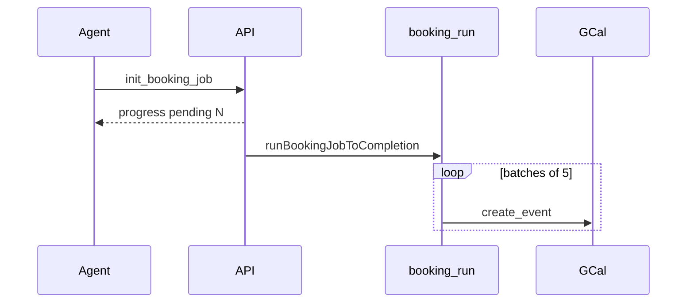

# Engineering Review: Production Hardening & Scheduling Fixes (Full Session)

**Audience:** Lead software engineer — enterprise production readiness review  
**Scope:** **All material fixes** from this development session (multi-day booking through bulk cancel + voice gate), not only the latest changes  
**Last updated:** 2026-05-21  
**Smoke tests:** [MANUAL_SMOKE.md](./MANUAL_SMOKE.md)  
**Baseline product features:** [IMPLEMENTATION_SUMMARY.md](../IMPLEMENTATION_SUMMARY.md), [ARCHITECTURE.md](../ARCHITECTURE.md)

---

## 0. Document scope (read this first)

### What this document covers

Every **bug fix and hardening change** implemented during this session arc, grouped by production risk:

| ID | Theme | In first draft doc? |
|----|--------|---------------------|
| **F1** | Hybrid multi-day **booking job** (plan → init → SSE batches) | Partial |
| **F2** | **Day resolution** (full month weekdays, “every day”, explicit times) | Partial |
| **F3** | **Booking progress UI** (day rail, dedupe, job handoff) | Partial |
| **F4** | **Duplicate booking** (agent batch + client SSE racing) | Partial |
| **F5** | **Production audit** (SSE stale lock, replan stale job, confirmations) | **Missing** |
| **F6** | **Reschedule workflow** (`identify_event` + `reschedule_event` + cache) | **Missing** |
| **F7** | **Booking completion awareness** (no re-book after 100%) | Yes |
| **F8** | **Bulk cancel job** (mirror booking) | Yes |
| **F9** | **Realtime response gate** (`response.create` races) | Yes |
| **F10** | **Voice realtime tools** (dead duplicate handler fix) | **Missing** |

The **first version** of this file emphasized **F7–F9** (recent user-reported incidents). This revision is the **complete** review set for sign-off.

### What this document does not cover

Pre-existing capabilities that were not part of this fix session (still relevant for enterprise, but not “what we changed”):

- OAuth / per-user Google Calendar ([`middleware.ts`](../middleware.ts), [`lib/calendar/auth.ts`](../lib/calendar/auth.ts))
- Slot-filling, conflict resolver, ASAP `find_next_slot`
- Vercel deployment, Redis session TTL, working-hours UI
- General chat UI / slot picker

Treat [IMPLEMENTATION_SUMMARY.md](../IMPLEMENTATION_SUMMARY.md) as the feature baseline; treat **this doc** as the **delta audit**.

---

## 1. Executive summary (all fixes)

| ID | Symptom | Root cause | Primary fix location |
|----|---------|------------|----------------------|
| F1 | Multi-day booking stalls / only partial days run | No persisted job; N×`create_event` in one LLM turn | `booking-executor`, `/api/booking/run`, tools |
| F2 | “Weekdays next month” → ~5 days; 5 AM refused | First-week vs full-month parsing; hard working-hours prompt | `booking-days.ts`, `prompt-shared` |
| F3 | Duplicate progress cards; 100% → 0%; new job ignored | Client progress merge + SSE races | `booking-progress-ui.ts`, `app/page.tsx` |
| F4 | Same slot booked twice | `execute_booking_batch` + SSE both creating | `reconcilePendingItem`, `bookingRunActiveRef`, `booking/run` |
| F5 | Stuck “in progress” forever; re-plan during active job | `sseInProgress` never cleared; stale `bookingJob` | `job-sse.ts`, `multi-day-plan.stateUpdatesForNewPlan` |
| F6 | Reschedule misses “meeting at 4–7”; wrong event | `lookup_event` text search only; no session cache | `event-matcher.ts`, `event-cache.ts` |
| F7 | “100% booked” but agent re-books / conflicts | Voice/text never get completion authority | `booking-context.ts`, `app/page.tsx` |
| F8 | Cancel all → 34 cards, 3 deleted, voice errors | Serial `delete_event`; no cancel job | `cancel-executor`, `/api/cancel/run` |
| F9 | `active response in progress` on voice | Parallel tools each call `response.create` | `realtime-response-gate.ts` |
| F10 | Voice multi-day never starts SSE | Duplicate dead code in realtime tools route | `app/api/realtime/tools/route.ts` (merged handlers) |

**Verification:** 102 Jest tests; `npx tsc --noEmit` clean.

---

## 2. F1 — Hybrid booking job (foundation for multi-day)

### Issue

- Booking 10–30 meetings in one user request exceeded `MAX_TOOL_LOOPS` (8) when using repeated `create_event`.
- No durable progress; agent could not resume or report accurate counts.

### What we built

**Pattern:** `plan_multi_day_bookings` → user confirms → `init_booking_job` → optional `execute_booking_batch` (≤5) → **client SSE** [`/api/booking/run`](app/api/booking/run/route.ts) runs remaining batches.

**Core executor** — [`lib/agent/booking-executor.ts`](lib/agent/booking-executor.ts):

- `initBookingJob`, `executeBookingBatch`, `runBookingJobToCompletion`
- `getBookingProgress` snapshot for UI/API
- `evaluateInitBookingBlock` → `job_already_done` (see F4/F5)

**Tools** — [`lib/agent/tools.ts`](lib/agent/tools.ts): `plan_multi_day_bookings`, `init_booking_job`, `execute_booking_batch`.

**Chat integration** — [`app/api/chat/route.ts`](app/api/chat/route.ts): tool loop returns `bookingJob`, `startBookingRun`.

**Client runner** — [`app/page.tsx`](app/page.tsx) `runBookingJob()` reads SSE, updates single progress card.



### Code references

```200:237:lib/agent/booking-executor.ts
export async function initBookingJob(...) {
  const blocked = await evaluateInitBookingBlock(...);
  // ...
  hint: '... client will book remaining days via progress UI ...'
}
```

```78:101:app/api/booking/run/route.ts
const { job, progress, blocked } = await runBookingJobToCompletion(
  state.bookingJob, batchSize, async p => { send({ type: 'progress', ...p }); ... }, ...
);
send({ type: 'complete', ...progress, duplicateBlocked: blocked ?? false });
```

---

## 3. F2 — Day resolution & plan quality

### Issue

- “Every **weekday** next month” resolved to **first week only** (~5 days).
- “**Every day**” confused with weekdays.
- User-specified **5 AM** blocked by generic working-hours wording in prompts.

### What we changed

**[`lib/agent/booking-days.ts`](lib/agent/booking-days.ts)**

- `resolveAllWeekdaysInMonth(year, month, timezone, weekdayIndices)` — full calendar month Mon–Fri (or custom).
- `resolveAllDaysInMonth` — literal daily patterns.
- `filterFutureDays` — drops past ISO dates.
- Used from [`lib/agent/multi-booking.ts`](lib/agent/multi-booking.ts) `resolvePlanDays` with optional `userMessage`.

**[`lib/agent/multi-day-plan.ts`](lib/agent/multi-day-plan.ts)**

- `resolveInitEntries()` — if LLM passes **fewer** entries than `lastMultiDayPlan.initEntries`, server **replaces** with canonical plan (`overridden: true`).
- `buildPlanToolResult()` — when `totalDays > 7`, hint says **one-line summary only** (no `displayList` paste).
- `buildShortPlanSummary()` for `confirmedPlanSummary` on session.
- `stateUpdatesForNewPlan()` — clears stale in-progress job when user replans (see F5).

**[`lib/agent/prompt-shared.ts`](lib/agent/prompt-shared.ts)**

- `WORKING_HOURS_POLICY` — explicit clock time wins over 9–17 default.
- `MULTI_DAY_BOOKING_RULES` — monthOffset + weekdaysOnly, init once, SSE for remainder.

### Code references

```78:96:lib/agent/multi-day-plan.ts
export function resolveInitEntries(llmEntries, lastPlan) {
  if (llmEntries.length < canonical.length) {
    return { entries: canonical, overridden: true };
  }
}
```

```13:17:lib/agent/prompt-shared.ts
export const WORKING_HOURS_POLICY = `...
When the user names an explicit time ("5 AM", ...), use that exact time ... even if outside working hours.`
```

---

## 4. F3 — Booking progress UI (enterprise UX)

### Issue

- Long scrolling list of per-day lines (30+ rows).
- Multiple progress bubbles for one job.
- After job A hit 100%, starting job B did not show progress (stale merge rules).

### What we changed

**[`components/BookingDayRail.tsx`](components/BookingDayRail.tsx)** — dot timeline; density by count; `getProcessedPercent`.

**[`components/BookingProgress.tsx`](components/BookingProgress.tsx)** — rail + counters; failures only in `<details>`.

**[`lib/client/booking-progress-ui.ts`](lib/client/booking-progress-ui.ts)**

```20:44:lib/client/booking-progress-ui.ts
export function isNewBookingJob(current, next) {
  // new jobId after completed => accept
}
export function shouldApplyBookingProgress(current, next) {
  // reject completed → in_progress regression
  // reject booked === total then pending > 0 (stale SSE)
}
export function upsertBookingProgressMessage(...) {
  // single in-chat progress card
}
```

**[`app/page.tsx`](app/page.tsx)** — `latestProgressRef`, `upsertBookingProgressMessage`, ignore `duplicateBlocked` SSE chunks.

---

## 5. F4 — Duplicate booking execution

### Issue

- Progress showed booked, then **failed** on same days (double `create_event`).
- Agent called `execute_booking_batch` while client SSE also ran → duplicate creates / race.

### What we changed

**Reconcile before create** — [`lib/agent/booking-executor.ts`](lib/agent/booking-executor.ts):

```68:93:lib/agent/booking-executor.ts
async function reconcilePendingItem(item, calendarEvents) {
  // If matching event already on calendar at same slot → status booked (idempotent)
}
```

**Single client SSE runner** — [`app/page.tsx`](app/page.tsx):

```178:179:app/page.tsx
if (bookingRunActiveRef.current) return;
bookingRunActiveRef.current = true;
```

Removed unconditional “always start SSE” fallback after chat when job already finished.

**Server duplicate SSE guard** — [`app/api/booking/run/route.ts`](app/api/booking/run/route.ts):

```50:58:app/api/booking/run/route.ts
} else if (state.bookingJob.sseInProgress) {
  send({ type: 'complete', ...progress0, duplicateBlocked: true });
}
```

**Chat `startBookingRun` logic** — only when init/batch leave `pending > 0` and batch did not finish in-loop ([`app/api/chat/route.ts`](app/api/chat/route.ts)).

---

## 6. F5 — Production readiness audit (session todos)

### Issue

Enterprise failures from **state drift**: stale locks, stale jobs across replans, weak confirmation memory.

### What we changed

| Item | Problem | Fix |
|------|---------|-----|
| P0 jobId handoff | New booking after complete ignored | `isNewBookingJob` + reset `latestProgressRef` on new job |
| P1 SSE stale lock | Crash left `sseInProgress: true` | [`lib/agent/job-sse.ts`](lib/agent/job-sse.ts) `SSE_STALE_LOCK_MS` (10 min), clear in `booking/run` |
| P1 replan stale job | New `plan_multi_day` while old job pending | `stateUpdatesForNewPlan` → `bookingJob: null` |
| P1 conflict-only plans | Init with empty `autoBookable` | Hints + `init_booking_job` with per-conflict entries |
| P2 plan summary | Re-confirm after user already said yes | `bookingPlanConfirmed`, `confirmedPlanSummary` on session |

**Stale lock helper** (shared with cancel job):

```1:18:lib/agent/job-sse.ts
export const SSE_STALE_LOCK_MS = 10 * 60 * 1000;
export function isStaleSseLock(job) { ... }
export function clearSseLock(job) { ... }
```

**Session fields** — [`types/index.ts`](types/index.ts): `bookingPlanConfirmed`, `confirmedPlanSummary`, `lastMultiDayPlan`, `bookingJob.sseInProgress`, `entriesFingerprint`.

---

## 7. F6 — Reschedule & event identification

### Issue

- “Reschedule the meeting **4 to 7**” failed when using `lookup_event` (Google text search, not time-range).
- “The one you just booked” not resolved after batch booking.
- Manual `delete_event` + `create_event` left cache/session inconsistent.

### What we built

**Tools** — [`lib/agent/tools.ts`](lib/agent/tools.ts): `identify_event`, `reschedule_event` (preview `confirmed=false`, execute `confirmed=true`).

**Matcher** — [`lib/agent/event-matcher.ts`](lib/agent/event-matcher.ts):

- `runIdentifyEvent(timeMin, timeMax, { timeHint, summaryHint, day })` — lists events in range, scores matches.
- `runRescheduleEvent` — patch/move with confirmation gate.
- Uses cached events when range covered (avoid redundant list).

**Session event cache** — [`lib/agent/event-cache.ts`](lib/agent/event-cache.ts):

- `updateEventCache` on `list_events`
- `getCachedEventsForRange` for identify
- `invalidateEventCache` on delete/create/reschedule
- `buildCachedCalendarPromptBlock` injected into text prompt ([`lib/agent/prompt.ts`](lib/agent/prompt.ts))
- `pendingReschedule`, `lastRescheduledEvent` for follow-up reschedules

**Prompts** — [`lib/agent/prompt-shared.ts`](lib/agent/prompt-shared.ts) `RESCHEDULE_WORKFLOW_RULES`:

- Mandatory `identify_event` for time-based references.
- Forbid manual delete+create for reschedule.
- Use `bookingJob` booked items for “just booked” references.

### Code references

```50:60:lib/agent/prompt-shared.ts
export const RESCHEDULE_WORKFLOW_RULES = `## Reschedule / move (mandatory order)
1. identify_event(timeMin/timeMax for the stated day, timeHint + summaryHint ...)
4. On user yes → reschedule_event(..., confirmed=true)
...
Do NOT delete_event + create_event manually for reschedule.`
```

**Tests:** [`__tests__/agent/event-matcher-reschedule.test.ts`](../__tests__/agent/event-matcher-reschedule.test.ts), [`__tests__/agent/event-cache.test.ts`](../__tests__/agent/event-cache.test.ts).

---

## 8. F7 — Booking completion awareness (agent must trust 100%)

### Issue

UI: “Booking complete — 5 booked.” Agent: “issue with booking”, offers one-by-one, `create_event` → **conflict** with dinners just created.

**Root cause:** Completion lived in React/SSE only; **voice session never updated**; text prompt was one weak line.

### What we changed

**[`lib/agent/booking-context.ts`](lib/agent/booking-context.ts)** (new)

| Export | Role |
|--------|------|
| `buildBookingJobPromptBlock(state)` | Text system prompt when job finished |
| `buildBookingJobPromptBlockFromSnapshot(snap)` | Voice `session.update` append |
| `bookingCompleteConversationHint(snap)` | `[BOOKING_COMPLETE]` conversation item |
| `tryReconcileCreateEventWithBookingJob(...)` | Idempotent `create_event` success |

```41:62:lib/agent/booking-context.ts
export function buildBookingJobPromptBlock(state) {
  // FORBIDDEN: init_booking_job, execute_booking_batch, create_event, find_free_slots ...
  // If user asks whether meetings are booked, confirm YES ...
}
```

**Voice** — [`app/page.tsx`](app/page.tsx) `pushVoiceBookingCompleteContext` after SSE complete or `job_already_done` tool result:

```130:172:app/page.tsx
// session.update: baseInstructions + buildBookingJobPromptBlockFromSnapshot
// conversation.item.create: bookingCompleteConversationHint
```

**`create_event` guards** — [`app/api/chat/route.ts`](app/api/chat/route.ts), [`app/api/realtime/tools/route.ts`](app/api/realtime/tools/route.ts).

**Prompt rules 7–8** — [`lib/agent/prompt-shared.ts`](lib/agent/prompt-shared.ts) under `MULTI_DAY_BOOKING_RULES`.

---

## 9. F8 — Bulk cancel job

### Issue

“Cancel all this month” → 34 UI cards; serial `delete_event`; ~3 removed; voice `active response` error; `MAX_TOOL_LOOPS` limit in text.

### What we built

Same architecture as booking:

- `init_cancel_job` / `execute_cancel_batch` / [`/api/cancel/run`](app/api/cancel/run/route.ts)
- [`lib/agent/cancel-executor.ts`](lib/agent/cancel-executor.ts) — `resolveCancelEventIds` expands from `lastBulkCancelTarget` / cache
- [`lib/calendar/events.ts`](lib/calendar/events.ts) `listEventsPaginated()` — no silent 50 cap
- [`lib/agent/cancel-context.ts`](lib/agent/cancel-context.ts) — completion blocks (mirror F7)
- [`lib/client/cancel-progress-ui.ts`](lib/client/cancel-progress-ui.ts), [`components/CancelProgress.tsx`](components/CancelProgress.tsx)
- [`lib/agent/prompt-shared.ts`](lib/agent/prompt-shared.ts) `BULK_CANCEL_RULES`
- UI cap: [`app/page.tsx`](app/page.tsx) `capEventsForDisplay()` (5 + “…and N more”)

```43:54:lib/agent/cancel-executor.ts
export function resolveCancelEventIds(eventIds, state) {
  if (eventIds.length >= 2) return eventIds;
  if (target?.eventIds?.length) return target.eventIds;
  // ...
}
```

---

## 10. F9 — Realtime `response.create` gate

### Issue

```
Conversation already has an active response in progress: resp_…
```

Triggers: parallel `reschedule_event` / `delete_event`; tool completion while model still speaking; slot pick during active response.

### What we built

**[`lib/client/realtime-response-gate.ts`](lib/client/realtime-response-gate.ts)**

```43:80:lib/client/realtime-response-gate.ts
submitToolResult(callId, output) {
  // post function_call_output immediately
  // response.create only in flushPending() when no active response + no inflight tools
}
```

**[`app/page.tsx`](app/page.tsx)** wiring:

| Event / site | Behavior |
|--------------|----------|
| `response.created` | `onResponseCreated` |
| `response.done` / `failed` / `cancelled` | `onResponseEnded` → flush queue |
| `function_call_arguments.done` | `registerFunctionCall` then async handler |
| `handleRealtimeToolCall` | `submitToolResult` (no direct `response.create`) |
| `handleSlotPick` | `requestResponse()` |

**Tests:** [`__tests__/client/realtime-response-gate.test.ts`](../__tests__/client/realtime-response-gate.test.ts).

---

## 11. F10 — Voice realtime tools route hygiene

### Issue

[`app/api/realtime/tools/route.ts`](app/api/realtime/tools/route.ts) had **duplicate** `if` branches for `init_booking_job` / `execute_booking_batch` from an earlier merge. The branch that set `startBookingRun: true` was **dead code** → voice multi-day booking never triggered client SSE.

### What we changed

- Removed duplicate imports and duplicate handlers.
- Single code path per tool with `startBookingRun` / `startCancelRun` returned to client (same as chat).

**Reviewer check:** Voice multi-day confirm → network shows `POST /api/booking/run` after `init_booking_job`.

---

## 12. Enterprise production checklist (beyond this session)

Use this alongside functional smoke tests for sign-off.

### Security & tenancy

- [ ] Google OAuth enabled in prod (`SESSION_SECRET`, Redis auth keys)
- [ ] Calendar scoped per authenticated user (`withCalendarAuth`)
- [ ] No refresh tokens or secrets in client bundle / git

### Reliability

- [ ] Redis session TTL (2h) acceptable for your enterprise sessions
- [ ] Vercel `maxDuration` on [`app/api/booking/run/route.ts`](app/api/booking/run/route.ts) / cancel run sufficient for largest expected batch (60s today)
- [ ] SSE stale lock recovery validated after simulated crash (F5)
- [ ] Rate limits / quotas on Google Calendar API for bulk book/cancel (batch size 5 — tune if needed)

### Observability

- [ ] `[PERF]` logs adequate for prod (or map to your APM)
- [ ] `[SCHEDULER:*]` / debug logger entries reviewed for PII

### UX & compliance

- [ ] Bulk operations require explicit confirmation (booking + cancel)
- [ ] Voice errors surfaced in chat (`[Realtime][Error]`)
- [ ] Working hours disclaimer for enterprise policy (soft default only)

### Known limitations (documented, not fixed here)

| Limitation | Notes |
|------------|--------|
| No undo for cancel/delete | By design |
| No selective bulk cancel filters (“skip Break”) | Future `excludePatterns` |
| `listEvents()` still capped at 50 | Paginated path used in chat/voice list |
| Voice barge-in does not `response.cancel` | Gate prevents double-create only |
| `MAX_TOOL_LOOPS = 8` text | Bulk ops must use job tools, not loops |

---

## 13. Test coverage map (full)

| Area | Test file |
|------|-----------|
| Booking days | `__tests__/agent/booking-days.test.ts` |
| Booking executor / job_already_done | `__tests__/agent/booking-executor.test.ts` |
| Booking context / reconcile | `__tests__/agent/booking-context.test.ts` |
| Booking SSE lock | `__tests__/agent/booking-sse.test.ts` |
| Multi-day plan / init override | `__tests__/agent/multi-day-plan.test.ts` |
| Multi-booking plan days | `__tests__/agent/multi-booking.test.ts` |
| Event matcher / reschedule | `__tests__/agent/event-matcher-reschedule.test.ts` |
| Event cache | `__tests__/agent/event-cache.test.ts` |
| Cancel executor | `__tests__/agent/cancel-executor.test.ts` |
| Progress UI dedupe | `__tests__/client/booking-progress-ui.test.ts` |
| Realtime response gate | `__tests__/client/realtime-response-gate.test.ts` |
| Booking day rail | `__tests__/components/booking-day-rail.test.tsx` |
| State / session | `__tests__/agent/state.test.ts` |

Run: `npm test` · `npx tsc --noEmit`

---

## 14. File index (new + materially changed this session)

### New files

`lib/client/realtime-response-gate.ts`, `lib/agent/booking-context.ts`, `lib/agent/cancel-executor.ts`, `lib/agent/cancel-context.ts`, `lib/agent/job-sse.ts`, `lib/client/cancel-progress-ui.ts`, `components/CancelProgress.tsx`, `components/BookingDayRail.tsx` (if introduced this session), `app/api/cancel/run/route.ts`, `app/api/cancel/progress/route.ts`, related `__tests__/**`.

### High-touch existing files

`app/page.tsx`, `app/api/chat/route.ts`, `app/api/realtime/tools/route.ts`, `app/api/booking/run/route.ts`, `lib/agent/booking-executor.ts`, `lib/agent/booking-days.ts`, `lib/agent/multi-booking.ts`, `lib/agent/multi-day-plan.ts`, `lib/agent/event-matcher.ts`, `lib/agent/event-cache.ts`, `lib/agent/prompt-shared.ts`, `lib/agent/prompt.ts`, `lib/calendar/events.ts`, `types/index.ts`, `lib/session/store.ts`, `components/BookingProgress.tsx`, `components/ChatWindow.tsx`, `lib/client/booking-progress-ui.ts`.

---

## 15. Lead reviewer sign-off checklist (all fixes)

### Multi-day booking (F1–F2)

- [ ] Full-month weekdays plan count correct
- [ ] Explicit time outside 9–17 books when calendar free
- [ ] `resolveInitEntries` expands short LLM entry list

### Booking job integrity (F3–F5, F10)

- [ ] One progress card per job; stable 100%
- [ ] Second booking in same session works
- [ ] No duplicate creates on same slot
- [ ] Re-plan clears stale in-progress job
- [ ] Voice triggers `/api/booking/run`

### Reschedule (F6)

- [ ] “4 to 7” uses `identify_event`, not `lookup_event` alone
- [ ] `reschedule_event(confirmed=true)` after one confirmation

### Completion awareness (F7)

- [ ] No re-`create_event` after booking complete (text + voice)
- [ ] `[BOOKING_COMPLETE]` / session.update in voice logs

### Bulk cancel (F8)

- [ ] One confirm; rail to 100%; calendar cleared
- [ ] Paginated list for large months

### Voice stability (F9)

- [ ] Multi-tool turn (e.g. 3× reschedule) without `active response` error

---

## 16. Symptom → code quick lookup

| User said / saw | Fix IDs | Look here first |
|-----------------|---------|-----------------|
| Only 5 weekdays booked | F2 | `booking-days.ts`, `resolveInitEntries` |
| Progress jumped back to 0% | F3, F5 | `shouldApplyBookingProgress`, `isNewBookingJob` |
| Double bookings same slot | F4 | `reconcilePendingItem`, `booking/run` |
| Stuck in progress after crash | F5 | `job-sse.ts`, `booking/run` |
| Reschedule wrong meeting | F6 | `event-matcher.ts`, `event-cache.ts` |
| “Booking complete” but agent confused | F7 | `booking-context.ts`, `pushVoiceBookingCompleteContext` |
| Cancel 1-by-1, 3 of 34 | F8 | `init_cancel_job`, `runCancelJob` |
| 34 event cards | F8 | `capEventsForDisplay` |
| `active response in progress` | F9 | `realtime-response-gate.ts` |
| Voice book never finishes days | F10 | `realtime/tools` `startBookingRun` |

---

## 17. Related documentation

- [MANUAL_SMOKE.md](./MANUAL_SMOKE.md) — hands-on verification scripts  
- [ARCHITECTURE.md](../ARCHITECTURE.md) — pipelines (recommend adding `response.created` + gate to Voice Event Flow)  
- [IMPLEMENTATION_SUMMARY.md](../IMPLEMENTATION_SUMMARY.md) — full product feature list  
